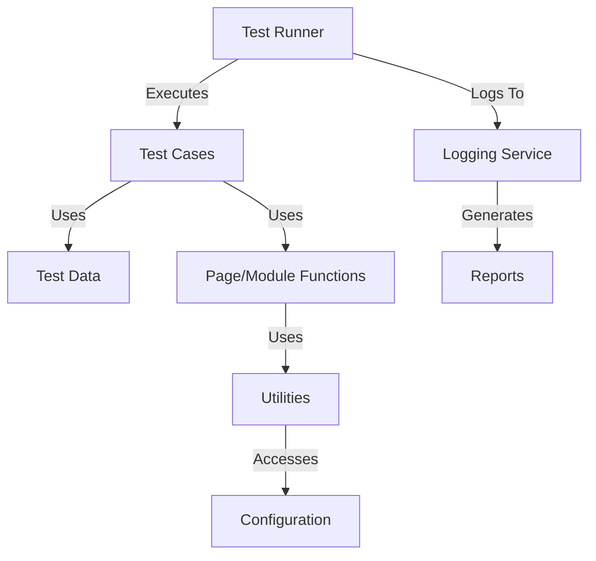
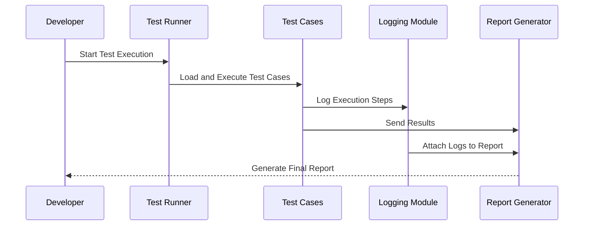
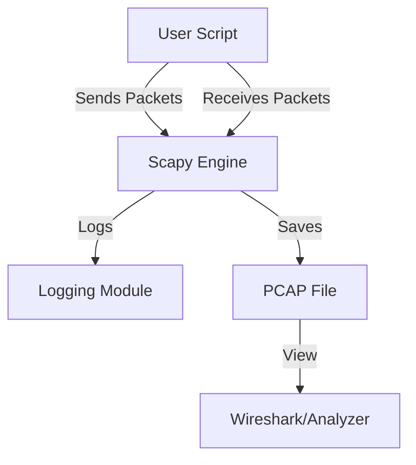
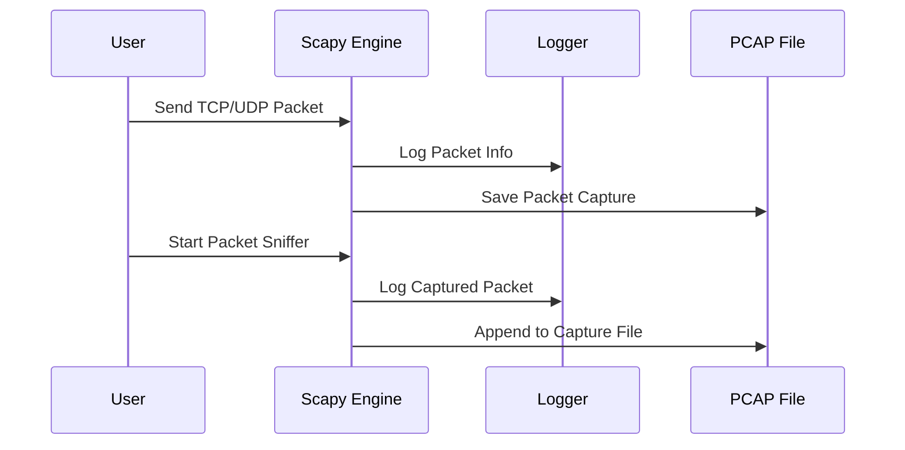

# capstone-projects
Detailed description of all possible capstone projects

# 1. Modular & Scalable Automation Framework

## 📌 Project Overview
This project aims to design and implement a **modular, scalable, and maintainable automation framework** suitable for functional, regression, and integration testing.  
The framework will be **extensible**, **easy to integrate**, and include a **centralized logging mechanism** for better debugging and reporting.

---

## 🎯 Objectives
- **Modularity** – Components should be independent and reusable.
- **Scalability** – Easy to extend for future test cases and modules.
- **Logging** – Centralized logging for test execution, errors, and reports.
- **Maintainability** – Clear separation of concerns with folder structure and naming conventions.
- **Reusability** – Shared utilities, helpers, and configurations.

---

## 🏗 Architecture Overview



---

## 📂 Proposed Folder Structure

```
automation-framework/
│
├── config/                # Configuration files (env, URLs, credentials)
│   └── config.yaml
│
├── core/                  # Core engine components
│   ├── runner.py
│   ├── logger.py
│   └── base_test.py
│
├── modules/               # Application-specific modules or page objects
│   ├── login_module.py
│   ├── search_module.py
│   └── checkout_module.py
│
├── tests/                 # Test cases
│   ├── test_login.py
│   ├── test_search.py
│   └── test_checkout.py
│
├── utils/                 # Utility functions and helpers
│   ├── data_loader.py
│   ├── api_client.py
│   └── file_handler.py
│
├── logs/                  # Execution logs
│   └── execution.log
│
├── reports/               # Test execution reports
│   └── report.html
│
├── requirements.txt       # Python dependencies
└── README.md
```

---

## ⚙️ Key Components

### 1. **Test Runner**
- Controls the execution flow.
- Can be implemented using `pytest`, `unittest`, or custom runner.
- Handles command-line arguments for environment selection.

### 2. **Logging Mechanism**
- Uses Python's `logging` module or `loguru` for enhanced logging.
- Supports:
  - INFO: Test steps and flow.
  - DEBUG: Detailed execution data.
  - ERROR: Failures and stack traces.
- Writes to both **console** and **log file**.

Example:
```python
import logging

logging.basicConfig(
    filename='logs/execution.log',
    level=logging.INFO,
    format='%(asctime)s - %(levelname)s - %(message)s'
)

logging.info("Test execution started.")
```

### 3. **Modular Design**
- **Page Object Model (POM)** or **Module-based** structure.
- Each feature or API is in its own module.
- Shared utilities and config to avoid redundancy.

### 4. **Configuration Management**
- Environment-specific configs (e.g., staging, production).
- YAML/JSON for easy editing.

### 5. **Reporting**
- Integrate with:
  - **Allure** for rich reports
  - HTMLTestRunner for lightweight HTML output
- Summary includes:
  - Passed/Failed counts
  - Execution time
  - Links to logs

---

## 🔄 Workflow Diagram



---

## 🚀 Setup & Installation

```bash
# Clone the repository
git clone https://github.com/yourusername/automation-framework.git
cd automation-framework

# Create virtual environment
python -m venv venv
source venv/bin/activate  # For Linux/Mac
venv\Scripts\activate     # For Windows

# Install dependencies
pip install -r requirements.txt
```

---

## ▶️ Running Tests

```bash
# Run all tests
pytest --html=reports/report.html --self-contained-html

# Run specific test
pytest tests/test_login.py
```
---

# 2. TCP & UDP Traffic Generation and Analysis using Scapy

## 📌 Project Overview
This project demonstrates how to **generate, capture, and analyze TCP & UDP network traffic** using the [Scapy](https://scapy.net/) Python library.  
It is designed for:
- **Learning** network protocol fundamentals.
- **Testing** firewall, IDS/IPS, and packet inspection tools.
- **Simulating** network conditions for research or QA purposes.

---

## 🎯 Objectives
- Send and receive **TCP** and **UDP** packets using Scapy.
- Capture and analyze packet data in real time.
- Provide **modular functions** for different traffic scenarios.
- Allow easy configuration of:
  - IP addresses
  - Ports
  - Payload content
  - Protocol parameters
- Implement **logging** for sent and received packets.

---

## 🏗 Architecture Overview



---

## 📂 Proposed Folder Structure

```
tcp-udp-scapy/
│
├── config/                # Configuration files
│   └── settings.yaml
│
├── core/                  # Core packet creation and handling
│   ├── tcp_sender.py
│   ├── udp_sender.py
│   ├── tcp_receiver.py
│   ├── udp_receiver.py
│   └── sniffer.py
│
├── utils/                 # Utilities and helpers
│   ├── logger.py
│   ├── packet_utils.py
│   └── file_handler.py
│
├── logs/                  # Execution logs
│   └── traffic.log
│
├── captures/              # PCAP files
│   └── capture.pcap
│
├── requirements.txt       # Python dependencies
└── README.md
```

---

## ⚙️ Key Components

### 1. **TCP Packet Sender**
Sends TCP packets to a target host with configurable parameters:
```python
from scapy.all import IP, TCP, send

packet = IP(dst="192.168.1.10")/TCP(dport=80, flags="S")
send(packet)
```

### 2. **UDP Packet Sender**
Sends UDP packets with payload:
```python
from scapy.all import IP, UDP, send

packet = IP(dst="192.168.1.10")/UDP(dport=53)/b"Hello UDP"
send(packet)
```

### 3. **Packet Sniffer**
Captures packets in real time and saves them to a `.pcap` file:
```python
from scapy.all import sniff, wrpcap

packets = sniff(count=10)
wrpcap("captures/capture.pcap", packets)
```

### 4. **Logging**
Logs packet details (source, destination, protocol, payload size):
```python
import logging

logging.basicConfig(
    filename='logs/traffic.log',
    level=logging.INFO,
    format='%(asctime)s - %(message)s'
)

logging.info("TCP packet sent to 192.168.1.10:80")
```

---

## 🔄 Workflow Diagram



---

## 🚀 Setup & Installation

```bash
# Clone the repository
git clone https://github.com/yourusername/tcp-udp-scapy.git
cd tcp-udp-scapy

# Create virtual environment
python -m venv venv
source venv/bin/activate  # For Linux/Mac
venv\Scripts\activate     # For Windows

# Install dependencies
pip install -r requirements.txt
```

`requirements.txt`:
```
scapy
pyyaml
```

---

## ▶️ Running the Project

### Send TCP Packet
```bash
python core/tcp_sender.py --target 192.168.1.10 --port 80 --flags S
```

### Send UDP Packet
```bash
python core/udp_sender.py --target 192.168.1.10 --port 53 --payload "Test UDP"
```

### Start Sniffer
```bash
python core/sniffer.py --count 20 --filter "tcp or udp"
```
---
