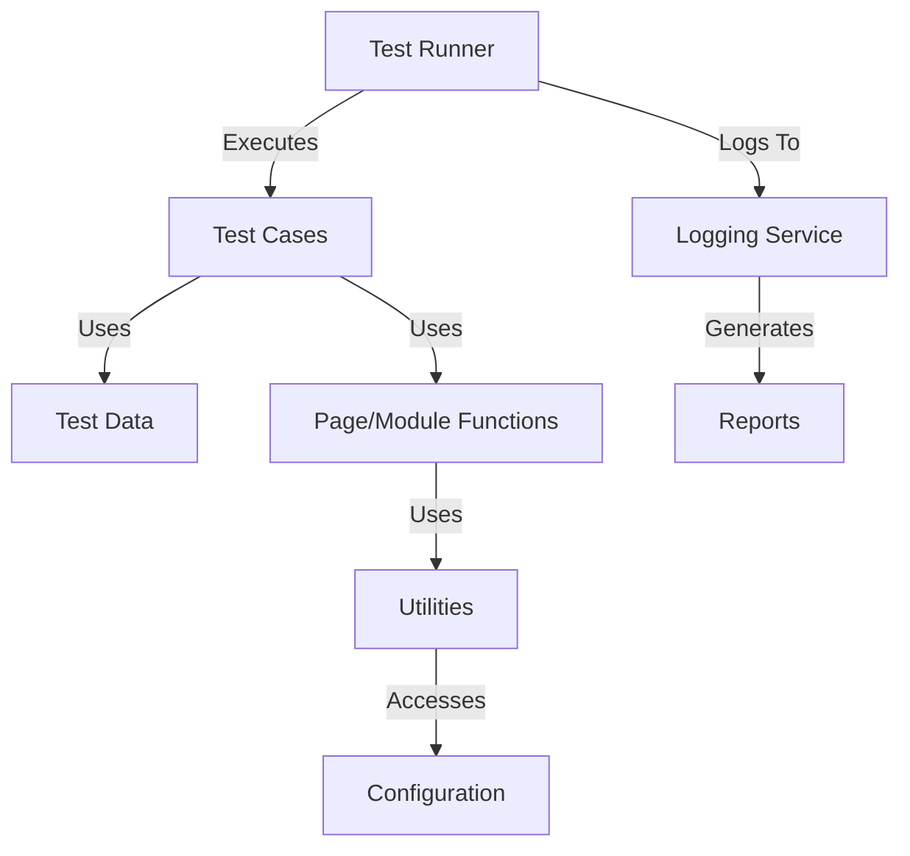
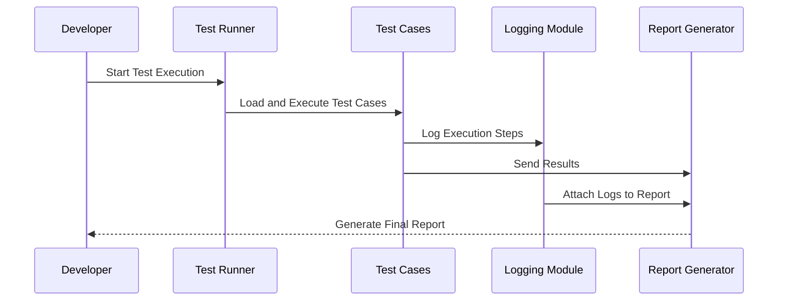
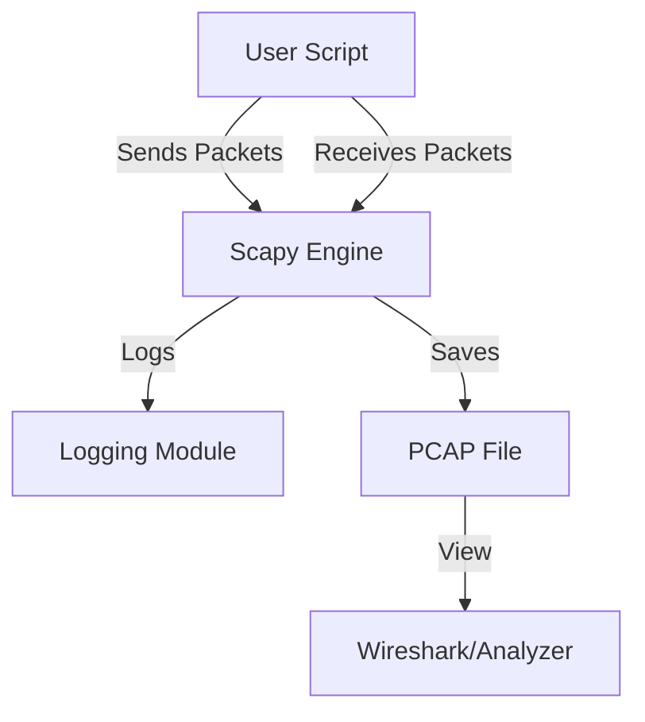
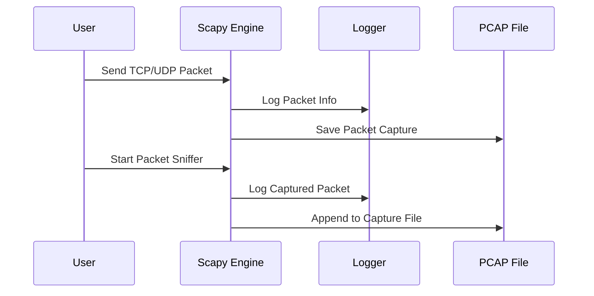

# capstone-projects
Detailed description of all possible capstone projects

# 1. Modular & Scalable Automation Framework

## 📌 Project Overview
This project aims to design and implement a **modular, scalable, and maintainable automation framework** suitable for functional, regression, and integration testing.  
The framework will be **extensible**, **easy to integrate**, and include a **centralized logging mechanism** for better debugging and reporting.

---

## 🎯 Objectives
- **Modularity** – Components should be independent and reusable.
- **Scalability** – Easy to extend for future test cases and modules.
- **Logging** – Centralized logging for test execution, errors, and reports.
- **Maintainability** – Clear separation of concerns with folder structure and naming conventions.
- **Reusability** – Shared utilities, helpers, and configurations.

---

## 🏗 Architecture Overview



---

## 📂 Proposed Folder Structure

```
automation-framework/
│
├── config/                # Configuration files (env, URLs, credentials)
│   └── config.yaml
│
├── core/                  # Core engine components
│   ├── runner.py
│   ├── logger.py
│   └── base_test.py
│
├── modules/               # Application-specific modules or page objects
│   ├── login_module.py
│   ├── search_module.py
│   └── checkout_module.py
│
├── tests/                 # Test cases
│   ├── test_login.py
│   ├── test_search.py
│   └── test_checkout.py
│
├── utils/                 # Utility functions and helpers
│   ├── data_loader.py
│   ├── api_client.py
│   └── file_handler.py
│
├── logs/                  # Execution logs
│   └── execution.log
│
├── reports/               # Test execution reports
│   └── report.html
│
├── requirements.txt       # Python dependencies
└── README.md
```

---

## ⚙️ Key Components

### 1. **Test Runner**
- Controls the execution flow.
- Can be implemented using `pytest`, `unittest`, or custom runner.
- Handles command-line arguments for environment selection.

### 2. **Logging Mechanism**
- Uses Python's `logging` module or `loguru` for enhanced logging.
- Supports:
  - INFO: Test steps and flow.
  - DEBUG: Detailed execution data.
  - ERROR: Failures and stack traces.
- Writes to both **console** and **log file**.

Example:
```python
import logging

logging.basicConfig(
    filename='logs/execution.log',
    level=logging.INFO,
    format='%(asctime)s - %(levelname)s - %(message)s'
)

logging.info("Test execution started.")
```

### 3. **Modular Design**
- **Page Object Model (POM)** or **Module-based** structure.
- Each feature or API is in its own module.
- Shared utilities and config to avoid redundancy.

### 4. **Configuration Management**
- Environment-specific configs (e.g., staging, production).
- YAML/JSON for easy editing.

### 5. **Reporting**
- Integrate with:
  - **Allure** for rich reports
  - HTMLTestRunner for lightweight HTML output
- Summary includes:
  - Passed/Failed counts
  - Execution time
  - Links to logs

---

## 🔄 Workflow Diagram



---

## 🚀 Setup & Installation

```bash
# Clone the repository
git clone https://github.com/yourusername/automation-framework.git
cd automation-framework

# Create virtual environment
python -m venv venv
source venv/bin/activate  # For Linux/Mac
venv\Scripts\activate     # For Windows

# Install dependencies
pip install -r requirements.txt
```

---

## ▶️ Running Tests

```bash
# Run all tests
pytest --html=reports/report.html --self-contained-html

# Run specific test
pytest tests/test_login.py
```
---

# 2. TCP & UDP Traffic Generation and Analysis using Scapy

## 📌 Project Overview
This project demonstrates how to **generate, capture, and analyze TCP & UDP network traffic** using the [Scapy](https://scapy.net/) Python library.  
It is designed for:
- **Learning** network protocol fundamentals.
- **Testing** firewall, IDS/IPS, and packet inspection tools.
- **Simulating** network conditions for research or QA purposes.

---

## 🎯 Objectives
- Send and receive **TCP** and **UDP** packets using Scapy.
- Capture and analyze packet data in real time.
- Provide **modular functions** for different traffic scenarios.
- Allow easy configuration of:
  - IP addresses
  - Ports
  - Payload content
  - Protocol parameters
- Implement **logging** for sent and received packets.

---

## 🏗 Architecture Overview



---

## 📂 Proposed Folder Structure

```
tcp-udp-scapy/
│
├── config/                # Configuration files
│   └── settings.yaml
│
├── core/                  # Core packet creation and handling
│   ├── tcp_sender.py
│   ├── udp_sender.py
│   ├── tcp_receiver.py
│   ├── udp_receiver.py
│   └── sniffer.py
│
├── utils/                 # Utilities and helpers
│   ├── logger.py
│   ├── packet_utils.py
│   └── file_handler.py
│
├── logs/                  # Execution logs
│   └── traffic.log
│
├── captures/              # PCAP files
│   └── capture.pcap
│
├── requirements.txt       # Python dependencies
└── README.md
```

---

## ⚙️ Key Components

### 1. **TCP Packet Sender**
Sends TCP packets to a target host with configurable parameters:
```python
from scapy.all import IP, TCP, send

packet = IP(dst="192.168.1.10")/TCP(dport=80, flags="S")
send(packet)
```

### 2. **UDP Packet Sender**
Sends UDP packets with payload:
```python
from scapy.all import IP, UDP, send

packet = IP(dst="192.168.1.10")/UDP(dport=53)/b"Hello UDP"
send(packet)
```

### 3. **Packet Sniffer**
Captures packets in real time and saves them to a `.pcap` file:
```python
from scapy.all import sniff, wrpcap

packets = sniff(count=10)
wrpcap("captures/capture.pcap", packets)
```

### 4. **Logging**
Logs packet details (source, destination, protocol, payload size):
```python
import logging

logging.basicConfig(
    filename='logs/traffic.log',
    level=logging.INFO,
    format='%(asctime)s - %(message)s'
)

logging.info("TCP packet sent to 192.168.1.10:80")
```

---

## 🔄 Workflow Diagram



---

## 🚀 Setup & Installation

```bash
# Clone the repository
git clone https://github.com/yourusername/tcp-udp-scapy.git
cd tcp-udp-scapy

# Create virtual environment
python -m venv venv
source venv/bin/activate  # For Linux/Mac
venv\Scripts\activate     # For Windows

# Install dependencies
pip install -r requirements.txt
```

`requirements.txt`:
```
scapy
pyyaml
```

---

## ▶️ Running the Project

### Send TCP Packet
```bash
python core/tcp_sender.py --target 192.168.1.10 --port 80 --flags S
```

### Send UDP Packet
```bash
python core/udp_sender.py --target 192.168.1.10 --port 53 --payload "Test UDP"
```

### Start Sniffer
```bash
python core/sniffer.py --count 20 --filter "tcp or udp"
```
---
# 3. Personal Expense Tracker (Python Desktop App)

## 📌 Project Overview
**Personal Expense Tracker** is a cross-platform desktop application built **entirely in Python** that helps users record, categorize, analyze, and export their personal expenses. The app is intended as a capstone project for students and is designed to be packaged as a standalone application (Windows `.exe`, macOS `.app`, and Linux binary) using tools like **PyInstaller**.

Primary goals:
- Simple, user-friendly GUI (Tkinter / PyQt5)
- Local persistence with **SQLite**
- Data analysis and visualization with **pandas** and **matplotlib**
- Export/import CSV and backup/restore database
- Packaged as a desktop application for distribution

---

## 🎯 Features
- Add / edit / delete transactions (amount, category, date, notes)
- Categorize transactions (Food, Travel, Bills, Income, etc.) and add custom categories
- Monthly / weekly / custom date-range summaries
- Charts for spending trends and category distribution
- Search and filter transactions (by date, category, amount range)
- Export transactions to CSV / Excel; Import from CSV
- Local SQLite database with backup/restore option
- Settings (currency, default category, theme toggle)
- Secure optional app-level PIN (lightweight protection for local use)
- Packaged installers/binaries for easy distribution

---

## 🏗 Architecture & Design

### High-level Components
- **UI Layer** — Tkinter (or PyQt5) windows, dialogs, and controls
- **Data Layer** — SQLite database access via `sqlite3` or `SQLAlchemy`
- **Business Logic** — transaction management, summaries, export/import
- **Reporting / Visualization** — `matplotlib` charts, optionally `seaborn`
- **Packaging** — PyInstaller configuration and build scripts

### Architecture Diagram
```mermaid
flowchart TD
    UI[UI Layer (Tkinter/PyQt)] -->|calls| BL[Business Logic]
    BL -->|reads/writes| DB[SQLite Database]
    BL -->|uses| UTIL[Utilities (CSV, backup, export)]
    BL -->|generates| CH[Charts (matplotlib)]
    UI -->|shows| CH
    Packager[PyInstaller] -->|bundles| App[Standalone App]
```

---

## 📂 Proposed Folder Structure

```
personal-expense-tracker/
│
├── app/                        # Application source code
│   ├── gui/                    # UI modules (windows, dialogs)
│   │   ├── main_window.py
│   │   ├── add_transaction.py
│   │   └── settings_dialog.py
│   ├── db/                     # Database layer
│   │   ├── models.py
│   │   └── repository.py
│   ├── services/               # Business logic (reports, import/export)
│   │   ├── reports.py
│   │   ├── export.py
│   │   └── importer.py
│   ├── utils/                  # Utility helpers (validation, formatting)
│   │   ├── logger.py
│   │   └── helpers.py
│   └── main.py                 # App entry point
│
├── resources/                  # Icons, images, sample DB
│   └── icon.png
│
├── tests/                      # Unit tests
│   └── test_repository.py
│
├── build/                      # Build artifacts (gitignored)
│
├── packaging/                  # PyInstaller spec, scripts
│   └── build_exe.sh
│
├── requirements.txt
├── README.md
└── LICENSE
```

---

## ⚙️ Tech Stack & Libraries
- Python 3.10+ (3.11 recommended)
- UI: **Tkinter** (built-in) or **PyQt5 / PySide6** (if a richer UI is desired)
- Database: **SQLite3** (standard library) optionally with **SQLAlchemy**
- Data processing: **pandas**
- Charting: **matplotlib**
- Packaging: **PyInstaller**
- Testing: **pytest**
- Optional: **cryptography** for PIN encryption, **openpyxl** for Excel export

Example `requirements.txt`:
```
pandas
matplotlib
pyinstaller
pyqt5       # only if using PyQt5 / optional
sqlalchemy  # optional
openpyxl    # if exporting to xlsx
cryptography # optional for PIN
pytest
```

---

## 🧩 Example Code Snippets

### 1) Database model (sqlite simple example)
```python
# app/db/repository.py
import sqlite3
from datetime import datetime

DB_PATH = "data/expenses.db"

def init_db():
    conn = sqlite3.connect(DB_PATH)
    c = conn.cursor()
    c.execute('''CREATE TABLE IF NOT EXISTS transactions (
                    id INTEGER PRIMARY KEY AUTOINCREMENT,
                    date TEXT NOT NULL,
                    amount REAL NOT NULL,
                    category TEXT NOT NULL,
                    notes TEXT
                )''')
    conn.commit()
    conn.close()

def add_transaction(date: str, amount: float, category: str, notes: str = ""):
    conn = sqlite3.connect(DB_PATH)
    c = conn.cursor()
    c.execute("INSERT INTO transactions (date, amount, category, notes) VALUES (?, ?, ?, ?)",
              (date, amount, category, notes))
    conn.commit()
    conn.close()
```

### 2) Simple Tkinter main window (skeleton)
```python
# app/gui/main_window.py
import tkinter as tk
from tkinter import ttk, messagebox
from app.db.repository import init_db, add_transaction

class MainWindow(tk.Tk):
    def __init__(self):
        super().__init__()
        self.title("Personal Expense Tracker")
        self.geometry("900x600")
        self.create_widgets()
        init_db()

    def create_widgets(self):
        # Top frame: Add transaction
        frm = ttk.Frame(self, padding=10)
        frm.pack(fill=tk.X)
        ttk.Label(frm, text="Amount").grid(row=0, column=0)
        self.amount_entry = ttk.Entry(frm); self.amount_entry.grid(row=0, column=1)
        ttk.Label(frm, text="Category").grid(row=0, column=2)
        self.category_entry = ttk.Entry(frm); self.category_entry.grid(row=0, column=3)
        ttk.Button(frm, text="Add", command=self.add_tx).grid(row=0, column=4)

    def add_tx(self):
        date = "2023-01-01"  # replace with datepicker value
        amount = float(self.amount_entry.get())
        category = self.category_entry.get()
        add_transaction(date, amount, category)
        messagebox.showinfo("Saved", "Transaction added")
```

### 3) Generating a summary chart with matplotlib
```python
# app/services/reports.py
import pandas as pd
import sqlite3
import matplotlib.pyplot as plt

def plot_monthly_spending(db_path="data/expenses.db"):
    conn = sqlite3.connect(db_path)
    df = pd.read_sql_query("SELECT date, amount, category FROM transactions", conn, parse_dates=["date"])
    df['month'] = df['date'].dt.to_period('M')
    monthly = df.groupby('month')['amount'].sum()
    monthly.plot(kind='bar', title='Monthly Spending')
    plt.tight_layout()
    plt.show()
```

---

## 🧪 Testing
- Unit tests for database repository functions using `pytest` and a temporary SQLite file.
- Mock GUI interactions where possible; focus testing on business logic and data layer.
- Example test file: `tests/test_repository.py`

---

## 📦 Packaging & Distribution (PyInstaller)

### PyInstaller basics
1. Install PyInstaller: `pip install pyinstaller`
2. From the repo root, build a one-file executable:
   ```bash
   pyinstaller --noconfirm --onefile --windowed --add-data "resources/icon.png:resources" app/main.py
   ```
   - `--windowed` prevents console on Windows/macOS GUI apps.
   - `--add-data` bundles resource files (format differs on Windows vs Linux/Mac).
3. Output is in `dist/` (executable) and `build/` (intermediate).

### Example `packaging/build_exe.sh` (Linux/macOS)
```bash
#!/usr/bin/env bash
pip install -r requirements.txt
pyinstaller --noconfirm --onefile --windowed --add-data "resources/icon.png:resources" app/main.py
```

### Notes for Windows
- Use `pyinstaller` on Windows or build on Linux with Wine for cross-building (complex).
- Test the produced executable on target OS before distributing.

---

## ✅ UX / Design Considerations
- Keep UI minimal and intuitive — focus on core flows (add, view, analyze).
- Validate inputs (positive amounts, valid dates).
- Provide keyboard shortcuts for power users.
- Provide export and backup options prominently.
- Make settings discoverable (currency, default export path).

---

## ♻️ Security & Privacy
- Data is stored locally; warn users that there is no cloud backup by default.
- If implementing a PIN, use `cryptography` to store a hashed/encrypted PIN in config.
- Do not log sensitive notes; keep logs local and rotate/prune them.

---

## 📌 Future Enhancements (Extensions for students)
- Cloud sync with OAuth (Google Drive, Dropbox) for backups.
- Mobile companion app (Kivy / BeeWare + Toga) to sync with desktop.
- Advanced analytics: forecasting monthly expenses using time-series models.
- Receipt scanning (OCR) to auto-create transactions.
- Multi-user support with role-based access (family accounts).

---

## 🧾 README Quick Start (for end users)
1. Download the packaged app for your OS from the `releases/` page.
2. Run the installer or unpack the archive.
3. Launch the app from the system menu (Windows Start / macOS Launchpad).
4. Create or open the existing database (`File → New Database` or `File → Open Database`).
5. Start adding transactions — use `Export` to save CSV backups.

---

## 📁 Sample Commands for Developers
```bash
# Run app in dev mode
python -m app.main

# Run unit tests
pytest -q

# Build executable (Linux/macOS)
bash packaging/build_exe.sh
```

---

## 📄 Licensing & Contribution
Include a LICENSE (MIT or Apache 2.0) and CONTRIBUTING.md if this project will accept external contributions. Provide clear code-of-conduct for student collaborations.

---

## 🖼️ Assets & Screenshots
Add placeholder screenshots in `resources/screenshots/` and reference them in the README with relative paths so GitHub displays them:
```markdown

```

---
